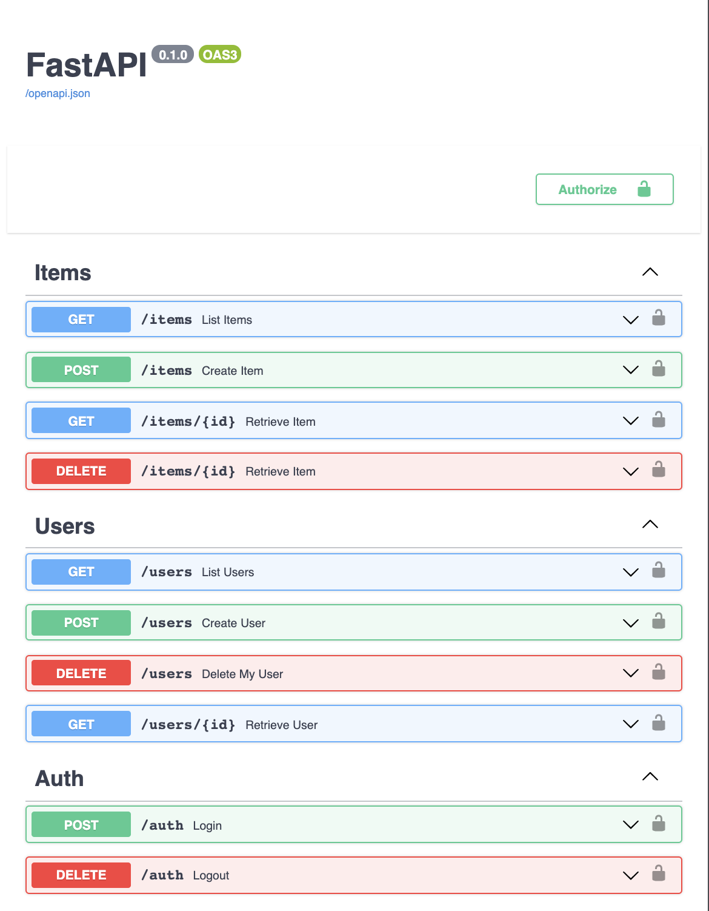

# fastapi-django-postgresql

Generate a FastAPI backend with Django-ORM and PostgreSQL

### Interactive API documentation

[](https://github.com/fletcheaston/fastapi-django-postgresql)

## Requirements
- Python >= 3.6 with pip installed

## Quickstart

### Install the latest [Cookiecutter](https://github.com/audreyr/cookiecutter) if you haven't installed it yet (this requires Cookiecutter 1.4.0 or higher):
```
pip install cookiecutter
```

### Point cookiecutter to this GitHub repository to automatically download and generate your project

```
cookiecutter https://github.com/fletcheaston/fastapi-django-postgresql
```

View the README.md of your new project for instructions on next steps
